# testyama

## Tables

| Name                                                                | Columns | Comment | Type       |
| ------------------------------------------------------------------- | ------- | ------- | ---------- |
| [administrator](administrator.md)                                   | 3       |         | BASE TABLE |
| [administrator_invitation](administrator_invitation.md)             | 5       |         | BASE TABLE |
| [administrator_login_credential](administrator_login_credential.md) | 4       |         | BASE TABLE |
| [feature_toggle](feature_toggle.md)                                 | 2       |         | BASE TABLE |
| [image](image.md)                                                   | 5       |         | BASE TABLE |
| [image_tag](image_tag.md)                                           | 5       |         | BASE TABLE |
| [image_tag_rel](image_tag_rel.md)                                   | 2       |         | BASE TABLE |
| [user](user.md)                                                     | 5       |         | BASE TABLE |
| [user_line_account](user_line_account.md)                           | 2       |         | BASE TABLE |
| [user_profile](user_profile.md)                                     | 5       |         | BASE TABLE |
| [user_service_agreement](user_service_agreement.md)                 | 3       |         | BASE TABLE |
| [user_tutorial_completion](user_tutorial_completion.md)             | 3       |         | BASE TABLE |

## Relations

```mermaid
erDiagram

"administrator_invitation" |o--|| "administrator" : "FOREIGN KEY (administrator_id) REFERENCES administrator (id)"
"administrator_login_credential" |o--|| "administrator" : "FOREIGN KEY (administrator_id) REFERENCES administrator (id)"
"image_tag_rel" }o--|| "image" : "FOREIGN KEY (image_id) REFERENCES image (id)"
"user_line_account" |o--|| "user" : "FOREIGN KEY (user_id) REFERENCES user (id)"
"user_profile" |o--|| "user" : "FOREIGN KEY (user_id) REFERENCES user (id)"
"user_service_agreement" }o--|| "user" : "FOREIGN KEY (user_id) REFERENCES user (id)"
"user_tutorial_completion" }o--|| "user" : "FOREIGN KEY (user_id) REFERENCES user (id)"
"feature_toggle" |o--|| "user" : "Detected Relation"
"image_tag_rel" }o--|| "image_tag" : "Detected Relation"

"administrator" {
  varchar_50_ id PK
  varchar_255_ email
  datetime_3_ deactivated_at
}
"administrator_invitation" {
  varchar_50_ administrator_id PK
  varchar_255_ hashed_token
  datetime_3_ expiration_date
  datetime_3_ invited_at
  datetime_3_ accepted_at
}
"administrator_login_credential" {
  varchar_50_ administrator_id PK
  varchar_255_ hashed_password
  datetime_3_ initialized_at
  datetime_3_ changed_at
}
"feature_toggle" {
  varchar_50_ user_id PK
  json settings
}
"image" {
  varchar_50_ id PK
  varchar_255_ admin_name
  varchar_255_ image_url
  datetime_3_ created_at
  datetime_3_ updated_at
}
"image_tag" {
  varchar_50_ id PK
  varchar_255_ admin_name
  tinyint_1_ is_locked
  datetime_3_ created_at
  datetime_3_ updated_at
}
"image_tag_rel" {
  varchar_50_ image_id PK
  varchar_50_ image_tag_id PK
}
"user" {
  varchar_50_ id PK
  varchar_32_ customer_number
  datetime_3_ signed_up_at
  varchar_50_ referrer
  varchar_2048_ first_access_path
}
"user_line_account" {
  varchar_50_ user_id PK
  varchar_50_ uid
}
"user_profile" {
  varchar_50_ user_id PK
  date birthday
  tinyint sex_code
  tinyint prefecture_code
  json initial_questionnaire_answers
}
"user_service_agreement" {
  varchar_50_ user_id PK
  varchar_50_ version PK
  datetime_3_ agreed_at
}
"user_tutorial_completion" {
  varchar_50_ user_id PK
  varchar_50_ version PK
  datetime_3_ completed_at
}
```

---

> Generated by [tbls](https://github.com/k1LoW/tbls)
