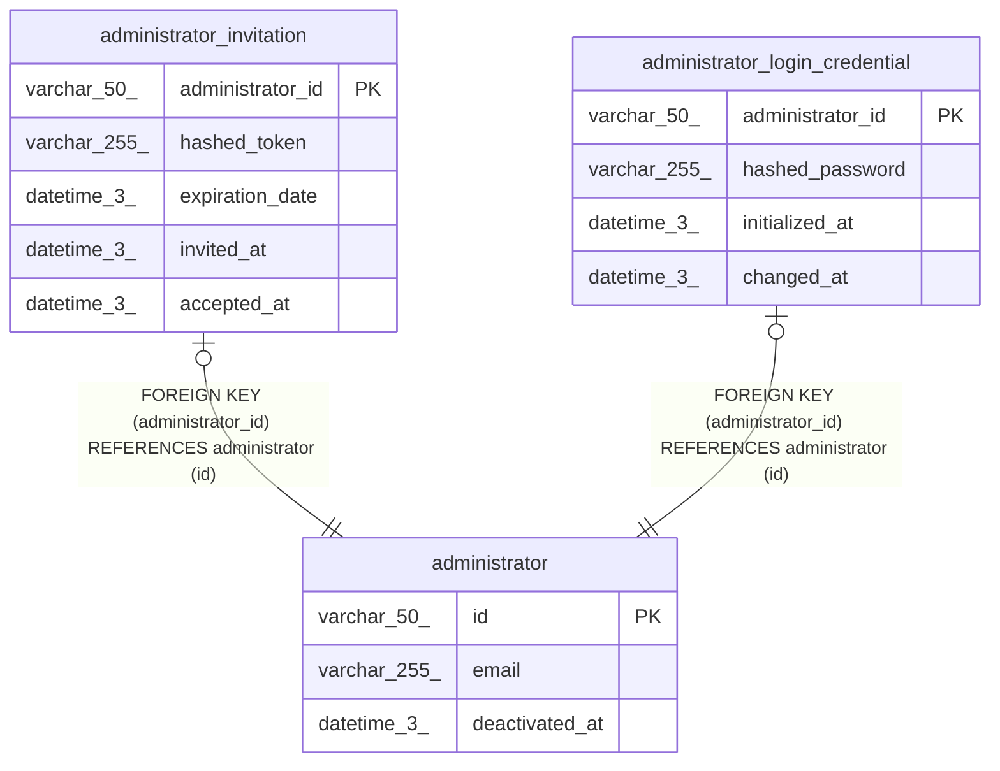

# administrator

## Description

<details>
<summary><strong>Table Definition</strong></summary>

```sql
CREATE TABLE `administrator` (
  `id` varchar(50) NOT NULL,
  `email` varchar(255) NOT NULL,
  `deactivated_at` datetime(3) DEFAULT NULL,
  PRIMARY KEY (`id`)
) ENGINE=InnoDB DEFAULT CHARSET=utf8mb4 COLLATE=utf8mb4_0900_ai_ci
```

</details>

## Columns

| Name           | Type         | Default | Nullable | Children                                                                                                                    | Parents | Comment |
| -------------- | ------------ | ------- | -------- | --------------------------------------------------------------------------------------------------------------------------- | ------- | ------- |
| id             | varchar(50)  |         | false    | [administrator_invitation](administrator_invitation.md) [administrator_login_credential](administrator_login_credential.md) |         |         |
| email          | varchar(255) |         | false    |                                                                                                                             |         |         |
| deactivated_at | datetime(3)  |         | true     |                                                                                                                             |         |         |

## Constraints

| Name    | Type        | Definition       |
| ------- | ----------- | ---------------- |
| PRIMARY | PRIMARY KEY | PRIMARY KEY (id) |

## Indexes

| Name    | Definition                   |
| ------- | ---------------------------- |
| PRIMARY | PRIMARY KEY (id) USING BTREE |

## Relations



---

> Generated by [tbls](https://github.com/k1LoW/tbls)
