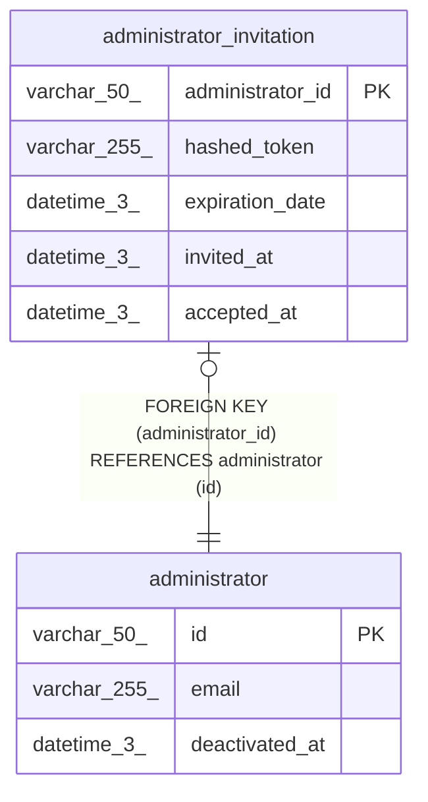

# administrator_invitation

## Description

<details>
<summary><strong>Table Definition</strong></summary>

```sql
CREATE TABLE `administrator_invitation` (
  `administrator_id` varchar(50) NOT NULL,
  `hashed_token` varchar(255) NOT NULL,
  `expiration_date` datetime(3) NOT NULL,
  `invited_at` datetime(3) NOT NULL,
  `accepted_at` datetime(3) DEFAULT NULL,
  PRIMARY KEY (`administrator_id`),
  CONSTRAINT `fk_administrator_invitation_administrator_id` FOREIGN KEY (`administrator_id`) REFERENCES `administrator` (`id`)
) ENGINE=InnoDB DEFAULT CHARSET=utf8mb4 COLLATE=utf8mb4_0900_ai_ci
```

</details>

## Columns

| Name             | Type         | Default | Nullable | Children | Parents                           | Comment |
| ---------------- | ------------ | ------- | -------- | -------- | --------------------------------- | ------- |
| administrator_id | varchar(50)  |         | false    |          | [administrator](administrator.md) |         |
| hashed_token     | varchar(255) |         | false    |          |                                   |         |
| expiration_date  | datetime(3)  |         | false    |          |                                   |         |
| invited_at       | datetime(3)  |         | false    |          |                                   |         |
| accepted_at      | datetime(3)  |         | true     |          |                                   |         |

## Constraints

| Name                                         | Type        | Definition                                                   |
| -------------------------------------------- | ----------- | ------------------------------------------------------------ |
| fk_administrator_invitation_administrator_id | FOREIGN KEY | FOREIGN KEY (administrator_id) REFERENCES administrator (id) |
| PRIMARY                                      | PRIMARY KEY | PRIMARY KEY (administrator_id)                               |

## Indexes

| Name    | Definition                                 |
| ------- | ------------------------------------------ |
| PRIMARY | PRIMARY KEY (administrator_id) USING BTREE |

## Relations



---

> Generated by [tbls](https://github.com/k1LoW/tbls)
