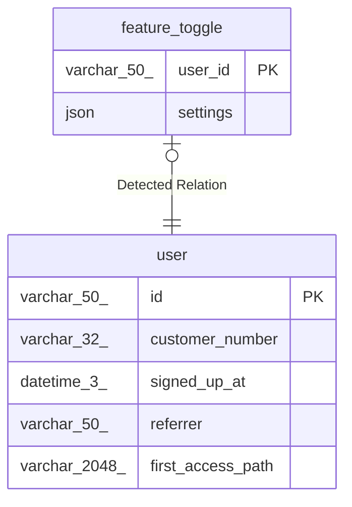

# feature_toggle

## Description

<details>
<summary><strong>Table Definition</strong></summary>

```sql
CREATE TABLE `feature_toggle` (
  `user_id` varchar(50) NOT NULL,
  `settings` json NOT NULL,
  PRIMARY KEY (`user_id`)
) ENGINE=InnoDB DEFAULT CHARSET=utf8mb4 COLLATE=utf8mb4_0900_ai_ci
```

</details>

## Columns

| Name     | Type        | Default | Nullable | Children | Parents         | Comment |
| -------- | ----------- | ------- | -------- | -------- | --------------- | ------- |
| user_id  | varchar(50) |         | false    |          | [user](user.md) |         |
| settings | json        |         | false    |          |                 |         |

## Constraints

| Name    | Type        | Definition            |
| ------- | ----------- | --------------------- |
| PRIMARY | PRIMARY KEY | PRIMARY KEY (user_id) |

## Indexes

| Name    | Definition                        |
| ------- | --------------------------------- |
| PRIMARY | PRIMARY KEY (user_id) USING BTREE |

## Relations



---

> Generated by [tbls](https://github.com/k1LoW/tbls)
