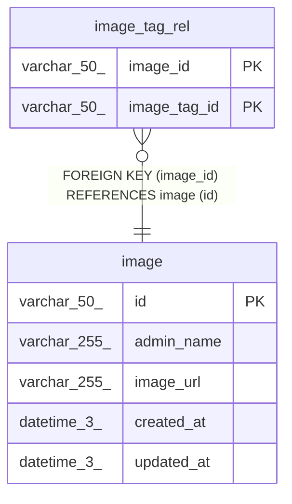

# image

## Description

<details>
<summary><strong>Table Definition</strong></summary>

```sql
CREATE TABLE `image` (
  `id` varchar(50) NOT NULL,
  `admin_name` varchar(255) NOT NULL,
  `image_url` varchar(255) NOT NULL,
  `created_at` datetime(3) NOT NULL,
  `updated_at` datetime(3) DEFAULT NULL,
  PRIMARY KEY (`id`)
) ENGINE=InnoDB DEFAULT CHARSET=utf8mb4 COLLATE=utf8mb4_0900_ai_ci
```

</details>

## Columns

| Name       | Type         | Default | Nullable | Children                          | Parents | Comment |
| ---------- | ------------ | ------- | -------- | --------------------------------- | ------- | ------- |
| id         | varchar(50)  |         | false    | [image_tag_rel](image_tag_rel.md) |         |         |
| admin_name | varchar(255) |         | false    |                                   |         |         |
| image_url  | varchar(255) |         | false    |                                   |         |         |
| created_at | datetime(3)  |         | false    |                                   |         |         |
| updated_at | datetime(3)  |         | true     |                                   |         |         |

## Constraints

| Name    | Type        | Definition       |
| ------- | ----------- | ---------------- |
| PRIMARY | PRIMARY KEY | PRIMARY KEY (id) |

## Indexes

| Name    | Definition                   |
| ------- | ---------------------------- |
| PRIMARY | PRIMARY KEY (id) USING BTREE |

## Relations



---

> Generated by [tbls](https://github.com/k1LoW/tbls)
