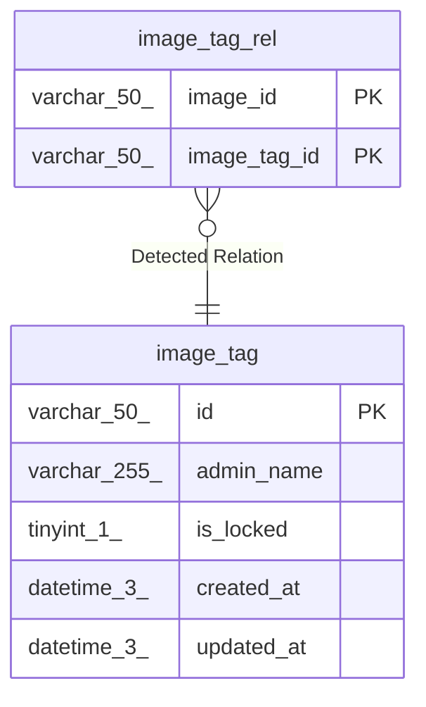

# image_tag

## Description

<details>
<summary><strong>Table Definition</strong></summary>

```sql
CREATE TABLE `image_tag` (
  `id` varchar(50) NOT NULL,
  `admin_name` varchar(255) NOT NULL,
  `is_locked` tinyint(1) NOT NULL,
  `created_at` datetime(3) NOT NULL,
  `updated_at` datetime(3) DEFAULT NULL,
  PRIMARY KEY (`id`),
  UNIQUE KEY `uniq_admin_name` (`admin_name`)
) ENGINE=InnoDB DEFAULT CHARSET=utf8mb4 COLLATE=utf8mb4_0900_ai_ci
```

</details>

## Columns

| Name       | Type         | Default | Nullable | Children                          | Parents | Comment |
| ---------- | ------------ | ------- | -------- | --------------------------------- | ------- | ------- |
| id         | varchar(50)  |         | false    | [image_tag_rel](image_tag_rel.md) |         |         |
| admin_name | varchar(255) |         | false    |                                   |         |         |
| is_locked  | tinyint(1)   |         | false    |                                   |         |         |
| created_at | datetime(3)  |         | false    |                                   |         |         |
| updated_at | datetime(3)  |         | true     |                                   |         |         |

## Constraints

| Name            | Type        | Definition                              |
| --------------- | ----------- | --------------------------------------- |
| PRIMARY         | PRIMARY KEY | PRIMARY KEY (id)                        |
| uniq_admin_name | UNIQUE      | UNIQUE KEY uniq_admin_name (admin_name) |

## Indexes

| Name            | Definition                                          |
| --------------- | --------------------------------------------------- |
| PRIMARY         | PRIMARY KEY (id) USING BTREE                        |
| uniq_admin_name | UNIQUE KEY uniq_admin_name (admin_name) USING BTREE |

## Relations



---

> Generated by [tbls](https://github.com/k1LoW/tbls)
