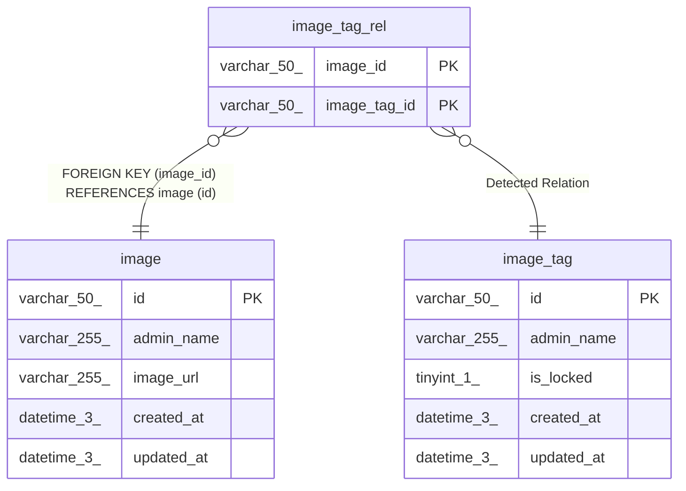

# image_tag_rel

## Description

<details>
<summary><strong>Table Definition</strong></summary>

```sql
CREATE TABLE `image_tag_rel` (
  `image_id` varchar(50) NOT NULL,
  `image_tag_id` varchar(50) NOT NULL,
  PRIMARY KEY (`image_id`,`image_tag_id`),
  CONSTRAINT `fk_image_tag_rel_image_id` FOREIGN KEY (`image_id`) REFERENCES `image` (`id`)
) ENGINE=InnoDB DEFAULT CHARSET=utf8mb4 COLLATE=utf8mb4_0900_ai_ci
```

</details>

## Columns

| Name         | Type        | Default | Nullable | Children | Parents                   | Comment |
| ------------ | ----------- | ------- | -------- | -------- | ------------------------- | ------- |
| image_id     | varchar(50) |         | false    |          | [image](image.md)         |         |
| image_tag_id | varchar(50) |         | false    |          | [image_tag](image_tag.md) |         |

## Constraints

| Name                      | Type        | Definition                                   |
| ------------------------- | ----------- | -------------------------------------------- |
| fk_image_tag_rel_image_id | FOREIGN KEY | FOREIGN KEY (image_id) REFERENCES image (id) |
| PRIMARY                   | PRIMARY KEY | PRIMARY KEY (image_id, image_tag_id)         |

## Indexes

| Name    | Definition                                       |
| ------- | ------------------------------------------------ |
| PRIMARY | PRIMARY KEY (image_id, image_tag_id) USING BTREE |

## Relations



---

> Generated by [tbls](https://github.com/k1LoW/tbls)
