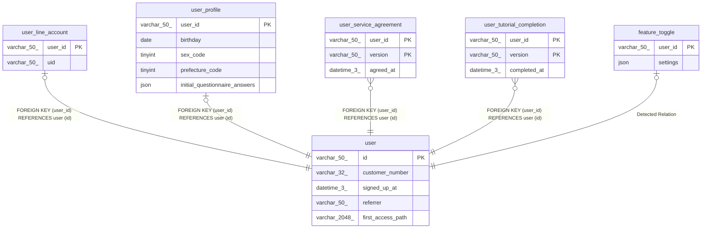

# user

## Description

<details>
<summary><strong>Table Definition</strong></summary>

```sql
CREATE TABLE `user` (
  `id` varchar(50) NOT NULL,
  `customer_number` varchar(32) NOT NULL,
  `signed_up_at` datetime(3) NOT NULL,
  `referrer` varchar(50) DEFAULT NULL,
  `first_access_path` varchar(2048) NOT NULL,
  PRIMARY KEY (`id`),
  UNIQUE KEY `uniq_customer_number` (`customer_number`)
) ENGINE=InnoDB DEFAULT CHARSET=utf8mb4 COLLATE=utf8mb4_0900_ai_ci
```

</details>

## Columns

| Name              | Type          | Default | Nullable | Children                                                                                                                                                                                                                  | Parents | Comment |
| ----------------- | ------------- | ------- | -------- | ------------------------------------------------------------------------------------------------------------------------------------------------------------------------------------------------------------------------- | ------- | ------- |
| id                | varchar(50)   |         | false    | [user_line_account](user_line_account.md) [user_profile](user_profile.md) [user_service_agreement](user_service_agreement.md) [user_tutorial_completion](user_tutorial_completion.md) [feature_toggle](feature_toggle.md) |         |         |
| customer_number   | varchar(32)   |         | false    |                                                                                                                                                                                                                           |         |         |
| signed_up_at      | datetime(3)   |         | false    |                                                                                                                                                                                                                           |         |         |
| referrer          | varchar(50)   |         | true     |                                                                                                                                                                                                                           |         |         |
| first_access_path | varchar(2048) |         | false    |                                                                                                                                                                                                                           |         |         |

## Constraints

| Name                 | Type        | Definition                                        |
| -------------------- | ----------- | ------------------------------------------------- |
| PRIMARY              | PRIMARY KEY | PRIMARY KEY (id)                                  |
| uniq_customer_number | UNIQUE      | UNIQUE KEY uniq_customer_number (customer_number) |

## Indexes

| Name                 | Definition                                                    |
| -------------------- | ------------------------------------------------------------- |
| PRIMARY              | PRIMARY KEY (id) USING BTREE                                  |
| uniq_customer_number | UNIQUE KEY uniq_customer_number (customer_number) USING BTREE |

## Relations



---

> Generated by [tbls](https://github.com/k1LoW/tbls)
