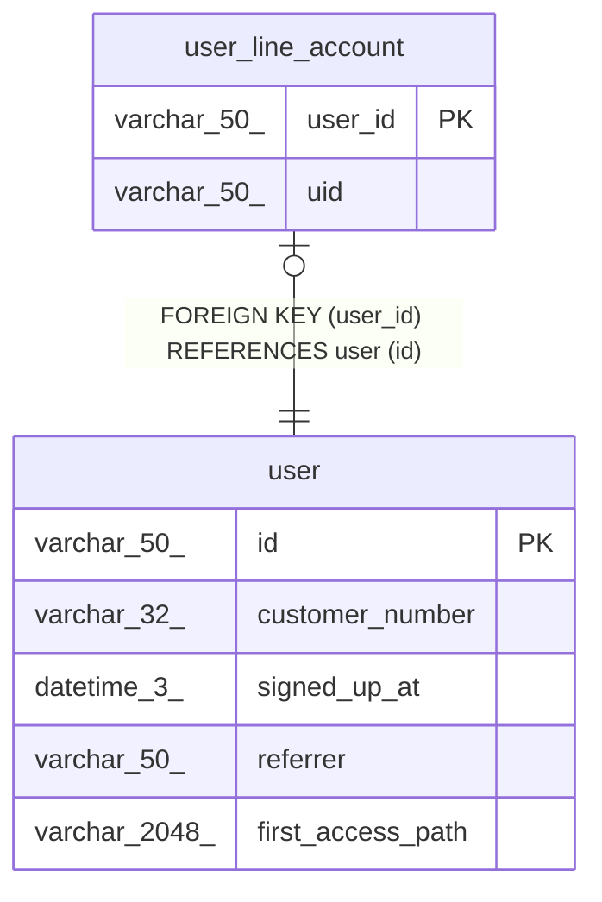

# user_line_account

## Description

<details>
<summary><strong>Table Definition</strong></summary>

```sql
CREATE TABLE `user_line_account` (
  `user_id` varchar(50) NOT NULL,
  `uid` varchar(50) NOT NULL,
  PRIMARY KEY (`user_id`),
  UNIQUE KEY `uniq_uid` (`uid`),
  CONSTRAINT `fk_user_line_account_user_id` FOREIGN KEY (`user_id`) REFERENCES `user` (`id`)
) ENGINE=InnoDB DEFAULT CHARSET=utf8mb4 COLLATE=utf8mb4_0900_ai_ci
```

</details>

## Columns

| Name    | Type        | Default | Nullable | Children | Parents         | Comment |
| ------- | ----------- | ------- | -------- | -------- | --------------- | ------- |
| user_id | varchar(50) |         | false    |          | [user](user.md) |         |
| uid     | varchar(50) |         | false    |          |                 |         |

## Constraints

| Name                         | Type        | Definition                                 |
| ---------------------------- | ----------- | ------------------------------------------ |
| fk_user_line_account_user_id | FOREIGN KEY | FOREIGN KEY (user_id) REFERENCES user (id) |
| PRIMARY                      | PRIMARY KEY | PRIMARY KEY (user_id)                      |
| uniq_uid                     | UNIQUE      | UNIQUE KEY uniq_uid (uid)                  |

## Indexes

| Name     | Definition                            |
| -------- | ------------------------------------- |
| PRIMARY  | PRIMARY KEY (user_id) USING BTREE     |
| uniq_uid | UNIQUE KEY uniq_uid (uid) USING BTREE |

## Relations



---

> Generated by [tbls](https://github.com/k1LoW/tbls)
