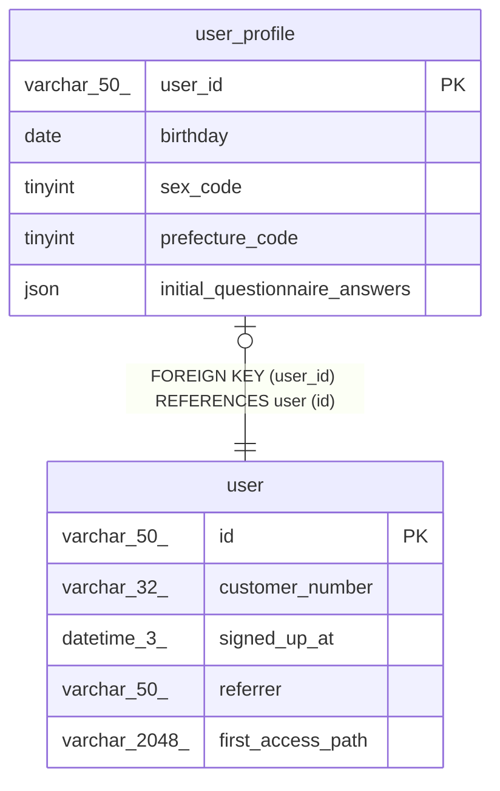

# user_profile

## Description

<details>
<summary><strong>Table Definition</strong></summary>

```sql
CREATE TABLE `user_profile` (
  `user_id` varchar(50) NOT NULL,
  `birthday` date DEFAULT NULL,
  `sex_code` tinyint DEFAULT NULL,
  `prefecture_code` tinyint DEFAULT NULL,
  `initial_questionnaire_answers` json DEFAULT NULL,
  PRIMARY KEY (`user_id`),
  CONSTRAINT `fk_user_profile_user_id` FOREIGN KEY (`user_id`) REFERENCES `user` (`id`)
) ENGINE=InnoDB DEFAULT CHARSET=utf8mb4 COLLATE=utf8mb4_0900_ai_ci
```

</details>

## Columns

| Name                          | Type        | Default | Nullable | Children | Parents         | Comment |
| ----------------------------- | ----------- | ------- | -------- | -------- | --------------- | ------- |
| user_id                       | varchar(50) |         | false    |          | [user](user.md) |         |
| birthday                      | date        |         | true     |          |                 |         |
| sex_code                      | tinyint     |         | true     |          |                 |         |
| prefecture_code               | tinyint     |         | true     |          |                 |         |
| initial_questionnaire_answers | json        |         | true     |          |                 |         |

## Constraints

| Name                    | Type        | Definition                                 |
| ----------------------- | ----------- | ------------------------------------------ |
| fk_user_profile_user_id | FOREIGN KEY | FOREIGN KEY (user_id) REFERENCES user (id) |
| PRIMARY                 | PRIMARY KEY | PRIMARY KEY (user_id)                      |

## Indexes

| Name    | Definition                        |
| ------- | --------------------------------- |
| PRIMARY | PRIMARY KEY (user_id) USING BTREE |

## Relations



---

> Generated by [tbls](https://github.com/k1LoW/tbls)
