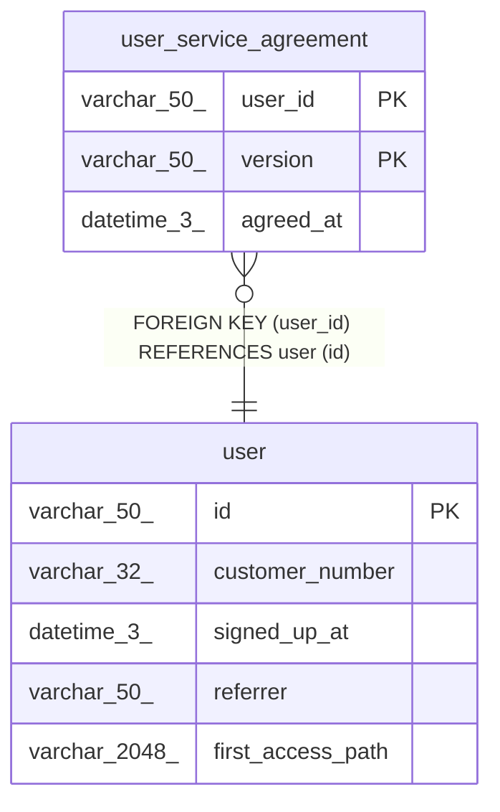

# user_service_agreement

## Description

<details>
<summary><strong>Table Definition</strong></summary>

```sql
CREATE TABLE `user_service_agreement` (
  `user_id` varchar(50) NOT NULL,
  `version` varchar(50) NOT NULL,
  `agreed_at` datetime(3) NOT NULL,
  PRIMARY KEY (`user_id`,`version`),
  CONSTRAINT `fk_user_service_agreement_user_id` FOREIGN KEY (`user_id`) REFERENCES `user` (`id`)
) ENGINE=InnoDB DEFAULT CHARSET=utf8mb4 COLLATE=utf8mb4_0900_ai_ci
```

</details>

## Columns

| Name      | Type        | Default | Nullable | Children | Parents         | Comment |
| --------- | ----------- | ------- | -------- | -------- | --------------- | ------- |
| user_id   | varchar(50) |         | false    |          | [user](user.md) |         |
| version   | varchar(50) |         | false    |          |                 |         |
| agreed_at | datetime(3) |         | false    |          |                 |         |

## Constraints

| Name                              | Type        | Definition                                 |
| --------------------------------- | ----------- | ------------------------------------------ |
| fk_user_service_agreement_user_id | FOREIGN KEY | FOREIGN KEY (user_id) REFERENCES user (id) |
| PRIMARY                           | PRIMARY KEY | PRIMARY KEY (user_id, version)             |

## Indexes

| Name    | Definition                                 |
| ------- | ------------------------------------------ |
| PRIMARY | PRIMARY KEY (user_id, version) USING BTREE |

## Relations



---

> Generated by [tbls](https://github.com/k1LoW/tbls)
