# フォント

## 基本方針

`next/font` でフォントを最適化しアプリ全体で利用。自動ホスト、CSS/フォントファイル最適化でパフォーマンス向上

1.  **フォントオブジェクト生成**: `layout.tsx`等で `next/font` を使いフォントオブジェクト生成、CSS変数名指定
2.  **CSS変数適用**: 生成フォントの `.variable` を `<html>` や `<body>` の `className` に追加しグローバル化
3.  **Tailwind設定**: `tailwind.config.ts` の `theme.extend.fontFamily` でCSS変数を参照しフォントファミリー登録
4.  **利用**: Tailwindユーティリティでフォント指定

```mermaid
graph LR
    subgraph Font_Optimization_and_Definition [フォント最適化と定義]
        direction LR
        A["next/font (e.g., Noto_Sans_JP from next/font/google)"] -- Generates Font Object & CSS Variable --> B["layout.tsx (Applies CSS Variable to HTML body)"]
        B -- CSS Variable Name --> C["tailwind.config.ts (theme.extend.fontFamily)"]
        C -- Utility Classes --> D["Tailwind CSS Engine"]
    end

    subgraph Component_Usage [コンポーネントでの利用]
        direction LR
        E["YourPage.tsx / YourComponent.tsx"] -- Uses --> D
    end

    classDef file fill:#000,stroke:#000,stroke-width:2px
    classDef flow fill:#00f,stroke:000,stroke-width:2px

    class A,B,C,E file
    class D flow
```



## 具体的な実装手順 (`layout.tsx` の例)

### `layout.tsx` でのフォントオブジェクト生成とCSS変数指定

- `/mini/layout.tsx` で `next/font/google` から `Noto_Sans_JP` をインポートし生成
- `variable` オプションでCSS変数名 (`--noto-sans-jp-font`) を指定

```typescript
// /apps/web/app/(cushion)/layout.tsx
import { Noto_Sans_JP } from 'next/font/google';

const notoSansJP = Noto_Sans_JP({
  subsets: ['latin'], // サブセットを指定 (日本語フォントの場合、'japanese' もしくは指定なしでも可。ただしファイルサイズに影響)
  weight: 'variable', // 可変ウェイトを利用する場合
  variable: '--noto-sans-jp-font', // CSS変数名を指定
});

export default function MiniLayout({ children }: { children: React.ReactNode }) {
  return (
    <html lang="ja" className="h-full">
      <head>
        {/* eslint-disable-next-line @next/next/no-page-custom-font */}
        <link
          href="https://fonts.googleapis.com/css2?family=Noto+Color+Emoji&family=Noto+Sans+JP&family=Shippori+Mincho:wght@400;500;600;700&display=swap"
          rel="stylesheet"
        />
      </head>
      {/* 生成されたCSS変数をbodyタグのclassNameに適用 */}
      <body className={cn('h-full overflow-hidden font-main', notoSansJP.variable)}>
        {/* ... */}
      </body>
    </html>
  );
}
```

- `Noto_Sans_JP({...})`: フォント読込/最適化。`variable`で指定したCSS変数 (`--noto-sans-jp-font`) が生成され自動挿入
- `notoSansJP.variable`: Next.js生成のCSSクラス名。これが `--noto-sans-jp-font` を定義
- `font-main`: `tailwind.config.ts` のデフォルトフォント (推測)

### `tailwind.config.ts` でのフォントファミリー登録

`tailwind.config.ts` で `layout.tsx` のCSS変数を参照しフォントファミリー登録

```javascript
// 想定される tailwind.config.ts の内容
module.exports = {
  // ...他の設定...
  theme: {
    extend: {
      fontFamily: {
        // layout.tsxで指定したCSS変数を参照
        sans: ["var(--noto-sans-jp-font)", "sans-serif"], // Noto Sans JP を 'sans' として登録
        main: ["var(--noto-sans-jp-font)", "sans-serif"],
      },
      // ...他の拡張設定...
    },
  },
  // ...他の設定...
};
```

- `fontFamily.main`: `Noto Sans JP` (`var(--noto-sans-jp-font)`) を主要フォントに。`<body>` の `font-main` 適用で基本フォントに

### コンポーネントでのフォント利用

ReactコンポーネントではTailwindユーティリティ (`font-main`, `font-mincho`等) でフォント指定

```tsx
// 例: とあるコンポーネント
function MyComponent() {
  return (
    <div>
      {/* デフォルトで font-main (Noto Sans JP) が適用される */}
      <p>これはメインフォントです。</p>
      {/* 明示的に Noto Sans JP を指定する場合 */}
      <p className="font-mincho">
        このテキストはShippori Minchoで表示されます。
      </p>
    </div>
  );
}
```

## フォントウェイトとスタイル

- `next/font` で `weight: 'variable'` 指定時、可変ウェイトが利用可。Tailwind (`font-light` 等) で調整
- 特定ウェイトは `weight: ['400', '700']` のように配列で指定
- イタリックは `italic` クラスで適用可 (フォント対応時)

## `globals.css` との関連

- `next/font` 使用時、`@font-face` やフォント用CSS変数の手動記述は `globals.css` に不要 (`next/font` が処理)
- `globals.css` で他のグローバルスタイル (例: `body` のデフォルト色) は定義
