# スタイリング概要

Tailwind CSS と CSS Variables (カスタムプロパティ) を主に組み合わせたスタイリング

- **一貫性**: CSS変数とTailwindテーマでカラースキームを統一
- **再利用性**: cvaでバリアントベースのスタイルを定義し、再利用性と保守性を向上 (例: `Button`)
- **カスタマイズ性**: Tailwindユーティリティでコンポーネント毎に柔軟なスタイル調整が可能
- **ダークモード対応**: CSS変数の切り替えで容易に実現

```mermaid
graph LR
    subgraph Colors_Definition [色の定義]
        direction LR
        A["globals.css (:root, .dark)"] -- CSS Variables --> B["tailwind.config.ts (theme.extend.colors)"]
        B -- Utility Classes --> C["Tailwind CSS Engine"]
    end

    subgraph Component_Styling [コンポーネントのスタイリング]
        direction LR
        D["button.tsx (cva)"] -- Consumes --> C
        D -- Defines Variants --> E["Button Component Variants (e.g., variant='primary')"]
    end

    subgraph Component_Usage [コンポーネントの使用]
        direction LR
        F["YourPage.tsx / YourComponent.tsx"] -- Uses --> E
        F -- Directly Uses --> C
    end

    A --> D
    B --> D
    C --> F

    classDef file fill:#000,stroke:#000,stroke-width:2px
    classDef flow fill:#00f,stroke:000,stroke-width:2px

    class A,B,D,F file
    class C,E flow
```

