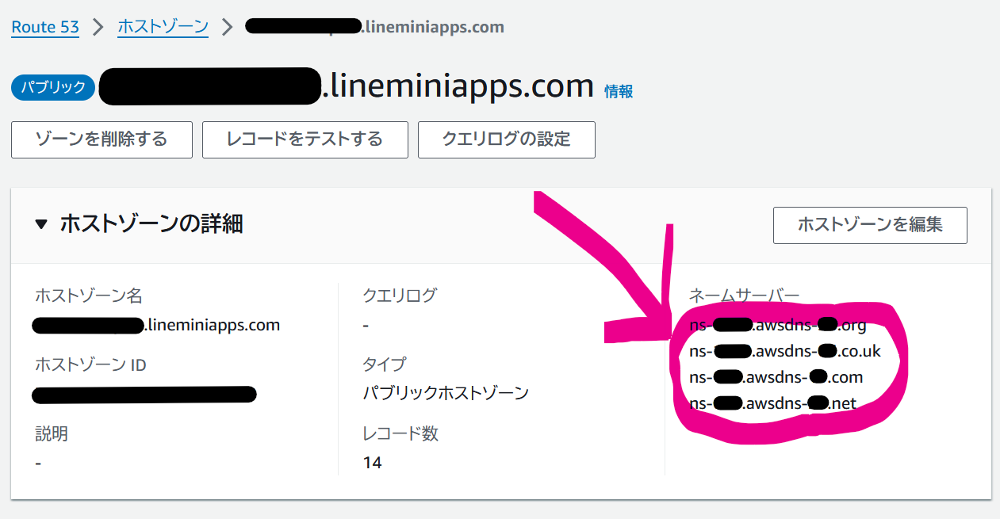
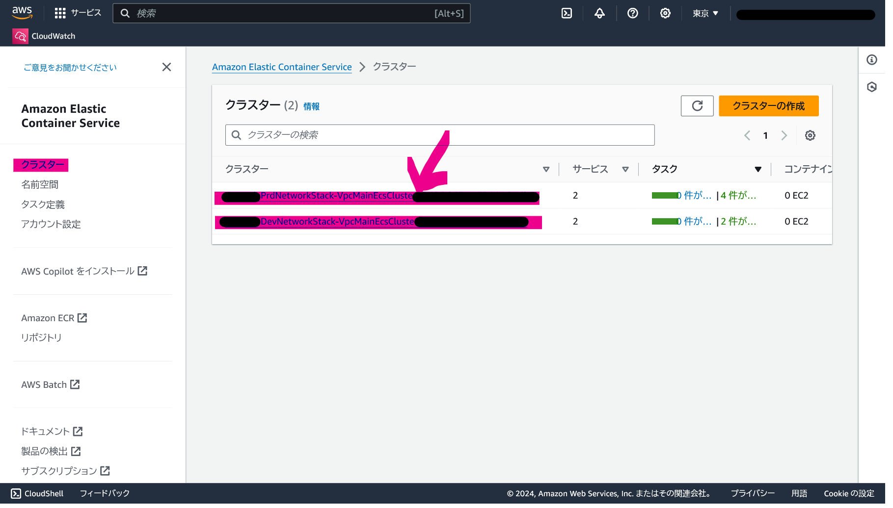
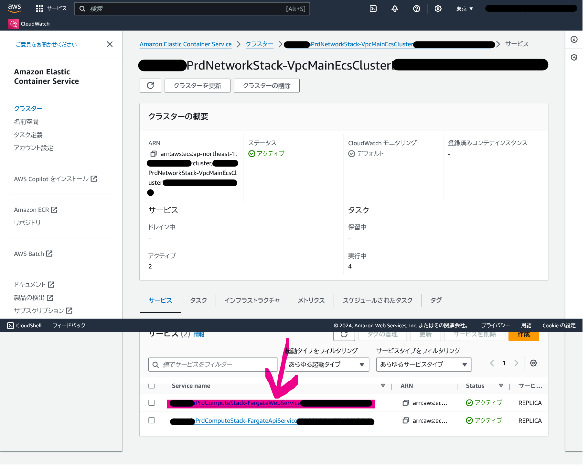
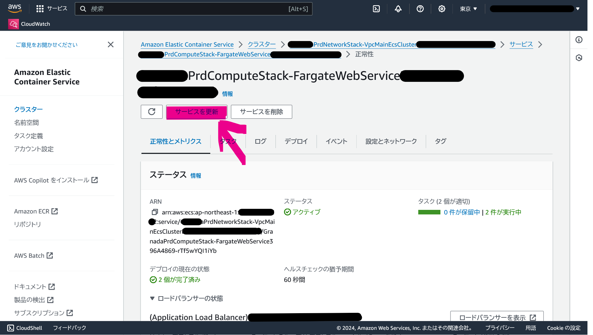

# 環境構築

## 【初回】環境構築前の準備

### PJ の AWS コンソール操作を AWS CLI コマンドから行えるようにする

本手順はＩＡＭユーザーからのアクセスキー発行を前提とする。ＡＷＳ ＳＳＯ（シングルサインオン）を使用する場合は後述する説明を参照すること。

#### アクセスキーとシークレットキーの発行

1. AWS コンソールにアクセス
1. IAM - ユーザー から自分のアカウントを開く
1. アクセスキーを作成
1. アクセスキーとシークレットキーをメモする

#### AWS CLI の設定

```
aws configure --profile xxxcodenamexxx
```

```
AWS Access Key ID [None]: AK****
AWS Secret Access Key [None]: ****
Default region name [None]: ap-northeast-1
Default output format [None]:
```

#### AWS CLI の設定確認

```
aws ec2 --profile xxxcodenamexxx describe-vpcs --query "Vpcs[].CidrBlock"
```

この時下記のような結果が得られることを確認する（具体的な内容に差異がありうる）。

```
[
    "172.31.0.0/16"
]
```

下記のケースでは `aws configure` 実行時に指定したリージョンにミスがある（期待値は `ap-northeast-1`）。`~/.aws/config` を編集して修正すること。

```
Could not connect to the endpoint URL: "https://ec2.リージョン.amazonaws.com/"
```

下記のケースでは `aws configure` 実行時に指定したアクセスキーまたはシークレットキーにミスがある。`~/.aws/credentials` を編集して修正すること。

```
An error occurred (AuthFailure) when calling the DescribeVpcs operation: AWS was not able to validate the provided access credentials
```

### サービスクォータの設定

#### VPC のクオータのリミットを上げる

EC2-VPC Elastic IPs を 5 → 20 に上げる。

下記コマンドを実行して現在のリミット値を確認する。

```
aws service-quotas --profile xxxcodenamexxx get-service-quota --service-code=ec2 --quota-code=L-0263D0A3 --query Quota.Value
```

20 未満であれば、下記コマンドを実行してリミット値を増やす。

```
aws service-quotas --profile xxxcodenamexxx request-service-quota-increase --service-code=ec2 --quota-code=L-0263D0A3 --desired-value 20
```

#### Fargate のクオータのリミットを上げる

下記コマンドを実行して現在のリミット値を確認する。

```
aws service-quotas --profile xxxcodenamexxx get-service-quota --service-code=fargate --quota-code=L-3032A538 --query "Quota.Value"
```

50 未満程度であれば、下記コマンドを実行してリミット値を増やすリクエストを投げる。
※10, 512, 4000 のどれかになっているケースが想定される。10 だった場合少なすぎるので上げるリクエストをする。

```
aws service-quotas --profile xxxcodenamexxx request-service-quota-increase --service-code=fargate --quota-code=L-3032A538 --desired-value 4000
```

このリクエストは 3 日以上かかるので、短期（1 日）での増加が必要であれば小さめ（30 程度）に抑えて申請すること。
この時要求される数値について説明が求められるので [AWS Support Console Case History](https://support.console.aws.amazon.com/support/home#/case/history) にて本ケースをモニタリング、質問に回答すること。
該当するケースヒストリーについては具体的には [Fargate On-Demand vCPU resource count](https://console.aws.amazon.com/servicequotas/home/services/fargate/quotas/L-3032A538?region=ap-northeast-1) から「リクエスト履歴」タブより、当該ケースヒストリーを参照できる。

### インフラの初期化

#### GitHub リポジトリのソースコードの展開と準備

※ ~/Documents/repos にプロジェクトのリポジトリをクローン済みであるものとする

```
cd ~/Documents/repos/xxxcodenamexxx
asdf install
make setup
git switch -c infra
cd infrastructures
```

以後の説明では `infrastructures` ディレクトリ・infra ブランチでの作業を前提とする。

#### コード修正（AWS アカウント ID の設定）

下記手順でプロファイル `xxxcodenamexxx` のアカウント ID を取得する。

```
aws --profile=xxxcodenamexxx --output=text sts get-caller-identity --query "Account"
```

以下のような内容が表示される。

```
123456789123
```

VSCode を開き `infrastructures/bin/infrastructures.ts` ファイルの以下の２箇所のコード、AWS アカウント ID を参照している箇所を上記の `123456789123` に書き換える。

- env 変数の設定

```
const env = {
  account: "000000000000",
  region: "ap-northeast-1",
};
```

- envGlobal 変数の設定

```
const envGlobal = {
  account: "000000000000",
  region: "us-east-1",
};
```

修正後の内容はコミットしておくこと。

#### 必要なパッケージのインストール

```
cd ~/Documents/repos/xxxcodenamexxx/infrastructures
pnpm install
```

#### CDK Bootstrap

先に設定したインフラコード内で指定されたＡＷＳ環境（ＡＷＳアカウントおよびリージョン）に対してＣＤＫデプロイに必要な各種セットアップを実施する。

```
cd ~/Documents/repos/xxxcodenamexxx/infrastructures
pnpm exec cdk bootstrap --profile=xxxcodenamexxx
```

#### DNS サーバの発行、ドメインの指定

##### ソースコードにドメインを設定

- `infrastructures/constants.ts`： 新規プロジェクト名に変更する
- `infrastructures/lib/init-stack.ts`： zoneName を運用するドメイン名に変更する

##### Hosted Zone を作成し、example.lineminiapps.com 管理者に通知

```
pnpm exec cdk deploy --profile xxxcodenamexxx xxxcapitalizedcodenamexxxInitStack
```

- [AWS Console](https://console.aws.amazon.com/console/home?region=ap-northeast-1) で [Route53](https://console.aws.amazon.com/route53/v2/home) を開き、[HostedZone](https://console.aws.amazon.com/route53/v2/hostedzones) から `example.lineminiapps.com` のホストゾーン名とネームサーバーを確認する。
- `lineminiapps.com` ドメインの管理者（このケースでは重村）に**prd環境の**ホストゾーン名とネームサーバー（コピペ）を共有し、設定を依頼する（DNS サーバからサブドメインの管理を移譲してもらう設定）
- `lineminiapps.com` ドメインでない、お客様サービスドメインを使用する場合は、ドメイン管理者（通常お客様）に同様の対応を依頼する。その際、重村にフォローを依頼すること。あるいは重村・営業担当者経由で依頼する。



#### AWS WAF 利用可否の設定

- `infrastructures/lib/compute-stack.ts`： ＡＷＳ ＷＡＦを使用する場合 enableWaf を true に変える

```
    const alb = new Alb(this, "Alb", {
      vpc: props.vpc,
      hostedZone: props.hostedZone,
      certificate: props.certificate,
      alarmTopic: sns.alarmTopic,
      enableWaf: false,
    });
```

#### GitHub コミットを AWS 経由でデプロイする仕組みの設定

##### Docker ハブの認証情報の作成・保存

ビルドされたコード（≒ Docker Image）を Docker ハブにプッシュするときの認証設定。
（現状重村か金原が可能。）

1. [AWS Secrets Manager](https://console.aws.amazon.com/secretsmanager/home?region=ap-northeast-1) にアクセス
2. 「新しいシークレットを保存する」から `DockerHubSecret` という名前のシークレットを作成する

- シークレットタイプ： `その他のシークレットタイプ`
- キー/値のペア
- 設定内容
  - シークレットキー： `username` ／対応するシークレットキーの値を参照すること
  - シークレットキー： `access_token` ／対応するシークレットキーの値を参照すること
- 補足説明
  - 設定する内容（シークレットキーの値）については AWS アカウント ID `2062-1021-2437` にて[設定されている内容](https://console.aws.amazon.com/secretsmanager/secret?name=DockerHubSecret&region=ap-northeast-1)を参照すること。
  - この値（ユーザー名およびアクセストークン）は具体的には[Docker ハブ](https://hub.docker.com/settings/security)で発行されたものである。
- 暗号化キー： `aws/secretsmanager`
- シークレットの名前： `DockerHubSecret`
- オプションの説明、タグ、リソースのアクセス許可、シークレットをレプリケート： 設定不要
- 自動ローテーション： 設定不要

##### AWS CodePipeline と GitHub Repository の接続

以下の手順で作業するが、これは GitHub Organization owner でないとできないので owner に作業依頼する。

1. AWS CodePipeline の「設定」→ Connections の設定画面に遷移

- https://console.aws.amazon.com/codesuite/settings/connections?region=ap-northeast-1

2. 「接続を作成」押下
3. 値を入力
   - プロバイダーを選択する: `GitHub`
   - 接続名: `entermotion-jp`
4. 「GitHub に接続する」押下（GitHub の画面へ遷移する）
5. 「Authorize AWS Connector for GitHub」ボタンを押下（AWS コンソールに戻る）
6. 「アプリインストール - オプション」で検索欄をクリック、`43188263` が選択肢に出るはずなのでそれを選択
7. 「接続」ボタン押下
8. 作成完了画面に表示されている「ARN」を`infrastructures/lib/compute-stack.ts` ファイルの codestarConnectionArn の部分（`arn:aws:...` の部分）に設定する。

- ARN は作成完了画面を消してしまった場合でも[AWS コンソール画面](https://console.aws.amazon.com/codesuite/settings/connections?region=ap-northeast-1)から確認できる。
- lib/compute-stack.ts

```
const stackConfiguration = {
  github: {
    // CodeStar Connection は手動で作成する
    codestarConnectionArn:
      "arn:aws:codeconnections:ap-northeast-1:000000000000:connection/xxxxxxxx-xxxx-xxxx-xxxx-xxxxxxxxxxxx",
    owner: "entermotion-jp",
```

修正後の内容はコミットしておくこと。

#### LIFF ID の設定

`infrastructures/lib/compute-stack.ts` ファイルの環境ごと（サンドボックス、開発、STG、本番）の LIFF ID を取得の上、設定する。

```
     liffId: {
       snd: "0000000000-XXXXXXXX",
       dev: "0000000000-XXXXXXXX",
       stg: "0000000000-XXXXXXXX",
       prd: "0000000000-XXXXXXXX",
     },

```

修正後の内容はコミットしておくこと。

#### 設置済みＳＳＬ証明書の利用

ＤＮＳの設定の前にネットワーク構成を決めないといけない（ＮＡＴゲートウェイのＩＰアドレスの決定等）、お客様指定のＳＳＬ証明書を使用しなければいけない、といったケースに対応するカスタマイズについて説明する。

修正箇所としては `infrastructures/lib/network-stack.ts` と `infrastructures/lib/global-certificate-stack.ts` の２つのファイルで、証明書のＡＲＮを記載する設定を行う。
なおＮＡＴゲートウェイのＩＰアドレス決定のみが目的の場合は `network-stack.ts` だけの設定でよい。 後日、本カスタマイズを差し戻して再デプロイすること。

また使用するＳＳＬ証明書について、自己署名証明書は使えず、かならず認証局で署名されたものを使用する。
違うサービスドメインの証明書を設定することは可能だが、DataStack 発行までにサービスドメインの証明書を用意すること。
ＳＳＬ証明書の設置については [ap-northeast-1](https://console.aws.amazon.com/acm/home?region=ap-northeast-1)と[us-east-1](https://console.aws.amazon.com/acm/home?region=us-east-1) の二つリージョンの同じものを設置すること。

```
  certArn: { // arn:aws:acm:....
    snd: "",
    dev: "",
    stg: "",
    prd: "",
  },

```

修正後の内容はコミットしておくこと。

#### ロードバランサーのＤＮＳ設定の乗っ取り設定

前段にＷＡＦを導入したいなどの理由でロードバランサーではなく、ＷＡＦのＤＮＳを設定したい場合 `infrastructures/lib/compute-stack.ts` ファイルにて、環境毎に乗っ取りたいドメインの設定を実施する。

ただし、ゾーンアペックスによる制限の関係で `Web` だけは乗っ取りできない。その場合ロードバランサーのＤＮＳが設定されるが、ＷＡＦを通せないのと（後述する）セキュリティグループによる制限のため、アクセスは封印される。通常これが問題になることはない。
また設定できるレコード種別としてはＣＮＡＭＥに限定される。

なおキーワードとドメインの関係については以下の通りである。

- `Api`: `api.example.lineminiapps.com`
- `Web`: `example.lineminiapps.com`
- `WebWww`: `www.example.lineminiapps.com`

```
  albDomain: {
    snd: {
      Api: "",
      Web: "",
      WebWww: "",
    },
    dev: {
      Api: "",
      Web: "",
      WebWww: "",
    },
    stg: {
      Api: "",
      Web: "",
      WebWww: "",
    },
    prd: {
      Api: "",
      Web: "",
      WebWww: "",
    },
  } as const,
```

修正後の内容はコミットしておくこと。
なお ComputeStack がデプロイ済みの環境に、本変更を適用するとデプロイに失敗するので、
変更対象となる Route53 のレコードを手作業により削除してからデプロイすること。
ComputeStack を削除してからデプロイし直す方法が安全ではあるが、サービス停止を伴うのでリスクを考慮して決めること。

#### ロードバランサーのセキュリティグループの設定

前段にＷＡＦを導入したいなどの理由でロードバランサーへの入口を制限したい場合 `infrastructures/lib/compute-stack.ts` ファイルにて、環境毎にアクセスを許可したいＩＰアドレスを設定する。通常は全許可（`0.0.0.0/0`）のまま放置で問題無い。

```
  albSg: {
    snd: ["0.0.0.0/0"],
    dev: ["0.0.0.0/0"],
    stg: ["0.0.0.0/0"],
    prd: ["0.0.0.0/0"],
  },
```

修正後の内容はコミットしておくこと。

### コミットとマージ

以上の内容をいったん main にマージすること。引き続き環境構築を実施する場合はマージせずに続けても構わない。

## 【env 毎一度だけ】環境構築

1. （先の作業から続けている場合は無視してください）main ブランチから infra ブランチを切り、ローカルを infra ブランチの状態にする
2. ローカルファイルにこの手前の手順のドメイン名やＡＲＮ、LIFF ID の書き換えが反映されていることを確認する
3. ドメインの管理者（お客様または重村他）によるＤＮＳサーバの設定も先に終えておくこと
  - ＤＮＳサーバーの設定が完了していない場合、ＳＳＬ証明書の発行が進まないことに留意（７２時間以内に設定されないと失敗する）
4. infrastructures ディレクトリにて以下 `env` に応じたコマンドを実行する（この時差分が発生することがある）
5. ComputeStack 作成時に Slack の `#lineminiapps_alert` に通知メール着信確認のメールが届くので `Confirm Subscription` のリンクをクリックすること。また「済」リアクションで作業が完了していることを知らせる。
6. [ＲＤＳ管理コンソール](https://console.aws.amazon.com/rds/home?region=ap-northeast-1#databases:)画面を確認する
  - xxxcodenamexxxprd や xxxcodenamexxxdev 等で始まる各環境毎に１つしかクラスターが存在しないこと（特に prd 環境）
  - 特に `prd` 環境では削除保護が設定されているため、旧リソースを削除できずに多重デプロイとなるリスクがある

> [!CAUTION]
> データベースクラスターの多重デプロイの可能性についての注意喚起
> - タイミング起因（デプロイ中インターネットに通信できなかった等）による、デプロイの失敗や、リトライによる多重デプロイが発生する可能性がある
> - もし１環境に複数のデータベースクラスターが存在するようであれば、[完全にサーバ停止（データ削除）手順](#完全にサーバ停止データ削除手順) を参照して削除保護を解除した上で、リソースの消し込みを行う
> - リトライによる多重デプロイ発生を防ぐため、スタック（特にＲＤＳは DataStack に所属）を削除したのち、再度スタックのデプロイを実施するのが安全である
> - スタックの削除に成功しても ＲＤＳ等のリソースが残ることがあるので、その旨確認の上、不要なリソースを削除すること

- 例）snd 環境構築

```
pnpm exec cdk deploy --profile xxxcodenamexxx xxxcapitalizedcodenamexxxSndNetworkStack xxxcapitalizedcodenamexxxSndGlobalCertificateStack xxxcapitalizedcodenamexxxSndDataStack xxxcapitalizedcodenamexxxSndComputeStack
```

- 例）dev 環境構築

```
pnpm exec cdk deploy --profile xxxcodenamexxx xxxcapitalizedcodenamexxxDevNetworkStack xxxcapitalizedcodenamexxxDevGlobalCertificateStack xxxcapitalizedcodenamexxxDevDataStack xxxcapitalizedcodenamexxxDevComputeStack
```

- 例）stg 環境構築

```
pnpm exec cdk deploy --profile xxxcodenamexxx xxxcapitalizedcodenamexxxStgNetworkStack xxxcapitalizedcodenamexxxStgGlobalCertificateStack xxxcapitalizedcodenamexxxStgDataStack xxxcapitalizedcodenamexxxStgComputeStack
```

- 例）prd 環境構築

```
pnpm exec cdk deploy --profile xxxcodenamexxx xxxcapitalizedcodenamexxxPrdNetworkStack xxxcapitalizedcodenamexxxPrdGlobalCertificateStack xxxcapitalizedcodenamexxxPrdDataStack xxxcapitalizedcodenamexxxPrdComputeStack
```

- infrastructures/cdk.context.json が生成されるため、これをコミットしておく
- 最初は空の適当なページ（OK と表示されている画面）が表示されるので、それが出来たら一旦インフラの構築は完了
- デプロイした環境に対応するブランチが作成されている場合、しばらくしてアプリケーションのデプロイが始まる
- 対応するブランチが無くても main ブランチから対応するブランチを切ると、アプリケーションのデプロイが始まる
- アプリケーションのデプロイ状況については [CodePipeline](https://console.aws.amazon.com/codesuite/codepipeline/pipelines?region=ap-northeast-1) 管理コンソールを確認すること
  - どの環境のパイプラインかは xxxcapitalizedcodenamexxxPrd（prd 環境）や xxxcapitalizedcodenamexxxDev（dev 環境）で始まる名前で見分ける

## 【初回】ＷａｆＣｈａｒｍ利用

[ＷａｆＣｈａｒｍ管理コンソール](https://console.wafcharm.com/ja)の「Config」→[Credential](https://console.wafcharm.com/ja/aws/credential-stores)→[Assume Role 既存のIAM Roleを登録する](https://console.wafcharm.com/ja/aws/credential-stores/create/assume-role)から「`IAM Role 信頼ポリシーを生成する`」ボタンを押してください。
ＪＳＯＮが表示されますので `sts:ExternalId` の値を `infrastructures/lib/wafcharm-stack.ts` のファイルの `externalId` の所に設定してください。

```
const stackConfiguration = {
  wafcharm: {
    externalId: "XXXXXXXXXXXX",
    principals: ["311635851477", "347433978697"],
    managedPolicies: ["AWSWAFFullAccess", "CloudWatchReadOnlyAccess"],
  },
};
```

その後デプロイします。修正した内容はコミットしておいてください。

```
pnpm exec cdk deploy --profile xxxcodenamexxx xxxcapitalizedcodenamexxxWafCharmStack
```

デプロイ完了後、[ＩＡＭロールの管理画面](https://console.aws.amazon.com/iam/home#/roles)にて `xxxcapitalizedcodenamexxxWafCharmStack-WafCharmRoleConstructWafChar-XXXXXXXXXXXX` というロールの詳細を表示、先ほど参照したＷａｆＣｈａｒｍの管理コンソールの画面の続きにある「`IAM RoleのARNを入力し、「検証」ボタンを押下してください。`」の指示にしたがって当該ＩＡＭロールのＡＲＮを入力、「検証」ボタンを押してください。
「OK」の表示が出れば設定は完了です。「次のステップへ」で設定を確定してください。またこの時、クレデンシャル名については「`xxxcapitalizedcodenamexxxWafCharmStack`」としてください（後述）。

次に[ＷＡＦ Ｃｏｎｆｉｇ管理画面](https://console.wafcharm.com/ja/aws/waf-configs)にて、ＡＷＳ ＷＡＦ連携のための設定を行ってください。

- `ＷｅｂＡＣＬ選択`画面
  - クレデンシャル： `xxxcapitalizedcodenamexxxWafCharmStack`
  - リージョン： `ap-northeast-1`
  - 「`WebACL取得`」ボタンを押す
  - 表示されたＷｅｂＡＣＬにチェックを入れて「次のステップへ」ボタンを押す
- `基本設定`画面
  - WAF Config名： `xxxcapitalizedcodenamexxxGlobalWebACL-XXXXXXXXXXXX` （デフォルト名にプロジェクト名を追加）
  - Ruleポリシー： `Advanced`
  - Credential Store： 先に設定したもの
  - 「次のステップへ」ボタンを押す
- `ルール設定`画面
  - 特に設定すべき内容は無し
  - 「次のステップへ」ボタンを押す
- `ログ・通知設定`
  - `WAFログ連携`タブにて
    - 「WAFログをWafCharmに連携する」ボタンにチェックを入れる
    - 「対象のWebACLでWAFログ出力設定が有効化されており、S3への出力となっていること」ボタンにチェックを入れる
    - 「WAFログに含まれる情報に個人情報や機密情報が含まれないこと（マスキング処理についてはこちらを参照）」ボタンにチェックを入れる
  - `WAFログアラート`タブにて「`WAFログアラートを使用する`」ボタンにチェックを入れないでおく
  - ＷＡＦログアラート機能を使いたい場合は以下の設定を行う
    - 「`WAFログアラートを使用する`」ボタンにチェックを入れる
    - 「`通知先メールアドレス`」に担当者ないしはメーリングリストの宛先を入れる
  - 「次のステップへ」ボタンを押す
- `登録内容確認`画面
  - 設定内容を確認して「登録する」ボタンを押す

本設定完了後、ＷａｆＣｈａｒｍから[ＷｅｂＡＣＬへのルール](https://console.aws.amazon.com/wafv2-pro/rule-groups?region=ap-northeast-1)のインポートが実施され、１～２分ほどで完了します。

実際の稼働状況については[ＡＷＳ ＷＡＦ管理コンソール](https://console.aws.amazon.com/wafv2-pro/protections?region=ap-northeast-1)と[ＷａｆＣｈａｒｍログコンソール](https://console.wafcharm.com/ja/aws/waflog-search)をご覧ください。

# 【env 毎一度だけ】環境デプロイ

infrastructures ディレクトリでコマンドを実行する。

- 例）snd 環境で compute-stack.ts を修正してデプロイする場合

```
pnpm exec cdk deploy --profile xxxcodenamexxx xxxcapitalizedcodenamexxxSndComputeStack
```

- 例）dev 環境で compute-stack.ts を修正してデプロイする場合

```
pnpm exec cdk deploy --profile xxxcodenamexxx xxxcapitalizedcodenamexxxDevComputeStack
```

- 例）stg 環境で compute-stack.ts を修正してデプロイする場合

```
pnpm exec cdk deploy --profile xxxcodenamexxx xxxcapitalizedcodenamexxxStgComputeStack
```

- 例）prd 環境で compute-stack.ts を修正してデプロイする場合

```
pnpm exec cdk deploy --profile xxxcodenamexxx xxxcapitalizedcodenamexxxPrdComputeStack
```

# 【運用】サーバー増強

`infrastructures/lib/compute-stack.ts` の `stackConfiguration.peakTimes` に設定を追加してデプロイすることで、**ピーク指定時間帯**のタスク最小・最大数を一時的に引き上げられます。
また、同ファイルの `stackConfiguration.autoscaler` にて増強倍率を設定できます。通常時間帯およびピーク指定時間帯における最小・最大タスク数の関係を、次の表にまとめます。

| 状態                           | 計算式                          | 現在の設定 | 備考                                                           |
| :----------------------------- | :------------------------------ | :--------- | :------------------------------------------------------------- |
| 通常時間帯の最小タスク数       | `desiredCount`                  | 2 (1)      | 通常時間帯の稼働台数の下限                                     |
| 通常時間帯の最大タスク数       | `desiredCount * autoscaler`     | 4 (1)      | 通常時間帯における CPU 負荷等によるオートスケール上限          |
| ピーク指定時間帯の最小タスク数 | `desiredCount * autoscaler`     | 4 (1)      | スパイクに備えた下限（prd のみ・`peakTimes` 適用時）           |
| ピーク指定時間帯の最大タスク数 | `desiredCount * autoscaler * 2` | 8 (1)      | スパイク時のオートスケール上限（prd のみ・`peakTimes` 適用時） |

※ prd 以外の環境は `autoscaler` が `1` に設定されているため（後述）、負荷に応じた自動増減は実質的に行われません。
※ 「現在の設定」は主に prd 環境の数字です。カッコ内は prd 環境以外（主に dev 環境）の環境の数字です。
※ `peakTimes` によるスケジュールは prd 環境のみにデプロイされます。ピーク指定時間帯では、当該スケジュールが有効な場合の値を示しています。
※ `peakTimes` が空のときはスケジュールによる切り替えは発生しません。

各環境のリソース設定は、`infrastructures/lib/compute-stack.ts` の `stackConfiguration`（`.fargate` と `.autoscaler`）で次のように定義されています。

| 環境    | サービス | ＣＰＵ  | メモリ  | 最小タスク数 | 増強倍率 | 通常時間帯の最大タスク数 | ピーク指定時間帯最大タスク数 |
| :------ | :------- | :------ | :------ | :----------- | :------- | :----------------------- | :--------------------------- |
| **prd** | `api`    | 2.0vCPU | 4096MiB | 2            | x2       | 4                        | 8                            |
|         | `web`    | 2.0vCPU | 4096MiB | 2            | x2       | 4                        | 8                            |
| **stg** | `api`    | 0.5vCPU | 1024MiB | 1            | x1       | 1                        | —                            |
|         | `web`    | 0.5vCPU | 1024MiB | 1            | x1       | 1                        | —                            |
| **dev** | `api`    | 0.5vCPU | 1024MiB | 1            | x1       | 1                        | —                            |
|         | `web`    | 0.5vCPU | 1024MiB | 1            | x1       | 1                        | —                            |
| **snd** | `api`    | 0.5vCPU | 1024MiB | 1            | x1       | 1                        | —                            |
|         | `web`    | 1.0vCPU | 2048MiB | 1            | x1       | 1                        | —                            |

※ 通常時間帯の最小タスク数は `desiredCount`、最大タスク数は `desiredCount * autoscaler` です。
※ ピーク指定時間帯の最小タスク数は `desiredCount * autoscaler`、最大タスク数は `desiredCount * autoscaler * 2` です。
※ prd 以外は `peakTimes` スケジュールがデプロイされないため、ピーク指定時間帯最大タスク数は「—」としています（理論値は `desiredCount * autoscaler * 2`）。
※ prd 以外の環境で負荷に応じた自動スケーリングを有効にする場合は、`autoscaler` を `1` より大きい値に変更してください。
※ 負荷試験等の理由でスケールアップしたい場合は `.fargate` 側のパラメータを調整してください。
※ `.fargate` の vCPU 設定については 1024 倍されているため、1.0vCPU＝1024ユニットと解釈して調整してください。メモリについては MiB 単位での指定となります。
※ また指定の組み合わせについてはＡＷＳ側の制限があります。0.5vCPU、8192MiB といった極端なバランスの指定はできません。
※ スケールアウトについては `desiredCount`（最小タスク数）と `.autoscaler` の設定によりコントロールされます。

## 設定時刻の目安

タスクの増強・削減には数分から十数分程度かかるため、余裕を持った設定を推奨します。

- **ピーク指定時間帯の開始 (`start`)**: 実際のイベント（メッセージ配信等）の **30分〜1時間前** を目安に設定します。
  - Fargate タスクのプロビジョニング、コンテナイメージのプル、およびアプリケーションの起動とヘルスチェック完了までに時間がかかります。
- **ピーク指定時間帯の終了 (`end`)**: イベント終了後、アクセスが十分に落ち着いたと思われる **30分〜1時間後** を目安に設定します。
  - 急激なタスク削減による残存タスクへの負荷集中を避けるため、余裕を持たせた設定を推奨します。
  - ただし負荷に応じて漸減されるため、高負荷状態であればゆっくり減少します。

設定例）scale-out-on-message-delivery_202403201100

```typescript
{
  id: "MessageDelivery_202403201100",
  start: {
    y: 2024,
    m: 3,
    d: 20,
    h: 0, // 9 in JST
    mi: 0,
  },
  end: {
    y: 2024,
    m: 3,
    d: 20,
    h: 5, // 14 in JST
    mi: 0,
  },
},
```

- `id` は `MessageDelivery_yyyymmddhhmm` 形式とし、既存設定と重複しない一意の値にする。
- `start` は上記目安を参考に、遅くとも業務開始前の時刻になるよう運用に合わせて調整する。
- 次回もスケールアウトする場合は既存設定を書き換えず、新しい設定を追加する。
- `peakTimes` は prd のみに適用されるが、運用手順としては各環境にデプロイする。
- デプロイ後は次のコマンドで設定を確認する。

```
aws --profile=xxxcodenamexxx application-autoscaling describe-scheduled-actions --service-namespace ecs
```

## タスク実行数の確認方法

Amazon Elastic Container Service > クラスター > prd クラスター > サービス

- web/api それぞれ現在要求されている 2 台中 2 台が実行中という形で確認可能
- この画面でタスクのタブに切り替えるとそれぞれのタスクの定義や開始時刻が分かる

# 【終了】サイトクローズ（アクセスできない状態にする）手順

- [AWS Console](https://console.aws.amazon.com/console/home?region=ap-northeast-1) > [ECS](https://console.aws.amazon.com/ecs/v2/clusters?region=ap-northeast-1)
- {Project}{Env}NetworkStack-VpcMainEcsCluster\*\*\* クラスターを選択
  
- さらに {Project}{Env}ComputeStack-FargateWebService\*\*\* サービスを選択
  
- 「サービスを更新」押下する
  
- 「必要なタスク数」に 0 を指定し、「サービスのオートスケーリングを使用」のチェックを外し「更新」押下
- 「タスク」タブでタスク一覧を確認し、タスクがありません、になってることを確認
- アプリを起動して 503 と表示されることを確認

# 完全にサーバ停止（データ削除）手順

## snd のリソースを削除

```
pnpm exec cdk destroy --profile xxxcodenamexxx xxxcapitalizedcodenamexxxSndComputeStack xxxcapitalizedcodenamexxxSndDataStack xxxcapitalizedcodenamexxxSndGlobalCertificateStack xxxcapitalizedcodenamexxxSndNetworkStack
```

cdk では削除できないリソースがあるため、Web コンソールより手動で削除する

- [CloudWatch](https://console.aws.amazon.com/cloudwatch/home?region=ap-northeast-1) > [ロググループ](https://console.aws.amazon.com/cloudwatch/home?region=ap-northeast-1#logsV2:log-groups)
  - xxxcapitalizedcodenamexxxSnd を含むロググループを削除（`ap-northeast-1`、`us-east-1` リージョンともに）

## dev のリソースを削除

```
pnpm exec cdk destroy --profile xxxcodenamexxx xxxcapitalizedcodenamexxxDevComputeStack xxxcapitalizedcodenamexxxDevDataStack xxxcapitalizedcodenamexxxDevGlobalCertificateStack xxxcapitalizedcodenamexxxDevNetworkStack
```

cdk では削除できないリソースがあるため、Web コンソールより手動で削除する

- [CloudWatch](https://console.aws.amazon.com/cloudwatch/home?region=ap-northeast-1) > [ロググループ](https://console.aws.amazon.com/cloudwatch/home?region=ap-northeast-1#logsV2:log-groups)
  - xxxcapitalizedcodenamexxxDev を含むロググループを削除（`ap-northeast-1`、`us-east-1` リージョンともに）

## stg のリソースを削除

```
pnpm exec cdk destroy --profile xxxcodenamexxx xxxcapitalizedcodenamexxxStgComputeStack xxxcapitalizedcodenamexxxStgDataStack xxxcapitalizedcodenamexxxStgGlobalCertificateStack xxxcapitalizedcodenamexxxStgNetworkStack
```

cdk では削除できないリソースがあるため、Web コンソールより手動で削除する

- [CloudWatch](https://console.aws.amazon.com/cloudwatch/home?region=ap-northeast-1) > [ロググループ](https://console.aws.amazon.com/cloudwatch/home?region=ap-northeast-1#logsV2:log-groups)
  - xxxcapitalizedcodenamexxxStg を含むロググループを削除（`ap-northeast-1`、`us-east-1` リージョンともに）

## prd のリソースを削除

### prd のスタックの削除保護を無効に（手動）

- [CloudFormation](https://console.aws.amazon.com/cloudformation/home?region=ap-northeast-1) > [スタック](https://console.aws.amazon.com/cloudformation/home?region=ap-northeast-1#/stacks)
  - 以下の削除保護を無効にする
    - xxxcapitalizedcodenamexxxPrdComputeStack
    - xxxcapitalizedcodenamexxxPrdDataStack
    - xxxcapitalizedcodenamexxxPrdGlobalCertificateStack
    - xxxcapitalizedcodenamexxxPrdNetworkStack

### prd の RDS のバックアップおよび削除（手動）

- [RDS](https://console.aws.amazon.com/rds/home?region=ap-northeast-1) > [データベース](https://console.aws.amazon.com/rds/home?region=ap-northeast-1#databases:)
  - １世代分しかバックアップを取って無いため、削除のタイミングでスナップショットを取っておく。
  - ロールが「リージョン別クラスター」を選んで「変更」から削除保護を無効化する（すぐに適用をチェックして無効化）
  - ロールが「リーダーインスタンス」を選んで「アクション」→「削除」を実施する
  - ロールが「ライターインスタンス」を選んで「アクション」→「削除」を実施する
  - ロールが「リージョン別クラスター」を選んで「アクション」→「削除」を実施する（最終スナップショットを作成、自動バックアップの保持をチェックして削除）

### prd のリソースを削除

```
pnpm exec cdk destroy --profile xxxcodenamexxx xxxcapitalizedcodenamexxxPrdComputeStack xxxcapitalizedcodenamexxxPrdDataStack xxxcapitalizedcodenamexxxPrdGlobalCertificateStack xxxcapitalizedcodenamexxxPrdNetworkStack
```

cdk では削除できないリソースがあるため、Web コンソールより手動で削除する

- [CloudWatch](https://console.aws.amazon.com/cloudwatch/home?region=ap-northeast-1) > [ロググループ](https://console.aws.amazon.com/cloudwatch/home?region=ap-northeast-1#logsV2:log-groups)
  - xxxcapitalizedcodenamexxxPrd を含むロググループを削除（`ap-northeast-1`、`us-east-1` リージョンともに）

## 共有リソースの削除

### 共有リソースの削除保護を無効に（手動）

- [CloudFormation](https://console.aws.amazon.com/cloudformation/home?region=ap-northeast-1) > [スタック](https://console.aws.amazon.com/cloudformation/home?region=ap-northeast-1#/stacks)
  - 以下の削除保護を無効にする
    - xxxcapitalizedcodenamexxxInitStack

### 共有リソースの削除

```
pnpm exec cdk destroy --profile xxxcodenamexxx xxxcapitalizedcodenamexxxInitStack
```

cdk では削除できないリソースがあるため、Web コンソールより手動で削除する

- [CloudWatch](https://console.aws.amazon.com/cloudwatch/home?region=ap-northeast-1) > [ロググループ](https://console.aws.amazon.com/cloudwatch/home?region=ap-northeast-1#logsV2:log-groups)
  - xxxcapitalizedcodenamexxxInitStack を含むロググループを削除（`ap-northeast-1`、`us-east-1` リージョンともに）
  - `/aws/chatbot/xxxcodenamexxx_alert` および `/aws/chatbot/xxxcodenamexxx_info` ロググループを削除（`us-east-1` リージョン）

### その他の共有リソース削除手順

- [Secrets Manager](https://console.aws.amazon.com/secretsmanager/landing?region=ap-northeast-1) > [シークレット](https://console.aws.amazon.com/secretsmanager/listsecrets?region=ap-northeast-1)
  - `DockerHubSecret` を選択して「シークレットを削除」する
- [CodePipeline](https://console.aws.amazon.com/codesuite/codepipeline/home?region=ap-northeast-1) > [パイプライン](https://console.aws.amazon.com/codesuite/codepipeline/pipelines?region=ap-northeast-1) > ▶ 設定 > [接続](https://console.aws.amazon.com/codesuite/settings/connections?region=ap-northeast-1)
  - 接続名 `entermotion-jp` を削除
- example.lineminiapps.com 管理者に NS レコード削除を依頼
- アプリを起動すると LINE のエラー画面が表示されることを確認
- AWS 解約してもよい旨、営業・事務担当に伝える

# 【メモ】Tips

## 環境変数の設定

- 環境変数を変更、追加する場合は infrastructures/lib/compute-stack.ts を編集する
- secrets (原則秘匿情報だけ) と、environments に設定したのがコンテナから環境変数として読める

## コマンド

- cdk synth ... 合成結果の CloudFormation テンプレートを確認できる
- cdk diff ... デプロイ前後の差分を確認できる

## 【メモ】プロジェクト立ち上げ時メモ

- `.tool-versions`、 `infrastructures/`、`docs/images/` を新規プロジェクトをコピーして立ち上げる
  - `pnpm-workspace.yaml` をコピーしておくとトップディレクトリで `pnpm i` した時に関連するディレクトリで `pnpm i` が実行されるが、`infrastructures` ディレクトリしかない状況ではほぼ不要である。
  - 同じ理由で `package.json` はコピー対象外としておく（`infrastructures/package.json` は別の話）。
- `.tool-versions` 内のアプリのバージョンを極力最新のものにしておく（場合によってはメジャーバージョンアップも考慮）
- 以下の設定を初期化すること
  - `infrastructures/bin/infrastructures.ts` ファイルの `env` と `envGlobal` の AWS アカウント ID の設定
  - `infrastructures/lib/compute-stack.ts` ファイルの `stackConfiguration` のコードスター ARN の設定
  - `infrastructures/lib/compute-stack.ts` ファイルの `liffId` 設定
- 以下のファイルを削除すること。
  - `infrastructures/cdk.context.json`
- 以下のファイルを修正すること。
  - `infrastructures/constants.ts`： 新規プロジェクト名に変更する
  - `infrastructures/lib/init-stack.ts`： 運用するドメイン名に変更する
- この時点でインフラ構築が必要な場合、以下の手順を実施すること。
  - トップディレクトリで `asdf install` の実行。
  - `infrastructures` ディレクトリで `pnpm i` の実行。

### infrastructures/constants.ts

```
export const CODE_NAME = "コードネーム";
```

### infrastructures/lib/init-stack.ts

```
     this.hostedZone = new aws_route53.HostedZone(this, "HostedZone", {
       zoneName: "運用ドメイン名（本番用）",
     });
```

```
     const sndHostedZone = new aws_route53.HostedZone(this, "SndHostedZone", {
       zoneName: "運用ドメイン名（サンドボックス用・「snd.サービスドメイン」で設定）",
     });

```

```
     const stgHostedZone = new aws_route53.HostedZone(this, "StgHostedZone", {
       zoneName: "運用ドメイン名（ステージング・審査用、「stg.サービスドメイン」で設定）",
     });

```

```
     const devHostedZone = new aws_route53.HostedZone(this, "DevHostedZone", {
       zoneName: "運用ドメイン名（開発用、「dev.サービスドメイン」で設定）",
     });

```

# データベースにアクセスする方法（参照のみ）

## 準備

### awscli

以下コマンドでバージョンが表示されればインストールされている

```
aws --version
```

インストールされていない場合はインストール

```
brew install awscli
```

#### 設定をしてない場合は設定

```
aws configure --profile xxxcodenamexxx
```

```
AWS Access Key ID [None]: AK****
AWS Secret Access Key [None]: ****
Default region name [None]: ap-northeast-1
Default output format [None]:
```

以下、xxxcodenamexxx という profile で credentials が保存されている前提で進める。

### session-manager-plugin

以下コマンドでバージョンが表示されればインストールされてる

```
session-manager-plugin --version
```

インストールされていない場合はインストール

```
brew install --cask session-manager-plugin
```

### ファイルの設置

- ecsconfig, ecsfw.sh の 2 ファイルをもらう
  - ecsfw.sh というファイルはどこで管理するのか未定
  - ecsconfig は接続プロファイルという位置付けの JSON ファイル
  - ecsconfig はセキュリティ的に、使う人以外に見せない
  - ecsfw.sh のオプションで指定する引数は ecsconfig にて定義されている必要がある
- 上記ファイルは ~/.aws/ の下にファイルを設置
  - ecsfw.sh はどこでも良いがこの例では同じ場所に置くことにする

## 実行

ecsfw.sh が置いてある場所に移動

```
cd ~/.aws
```

例：snd に接続する場合

```
sh ecsfw.sh xxxcodenamexxx-snd
```

例：dev に接続する場合

```
sh ecsfw.sh xxxcodenamexxx-dev
```

例：stg に接続する場合

```
sh ecsfw.sh xxxcodenamexxx-stg
```

例：prd に接続する場合

```
sh ecsfw.sh xxxcodenamexxx-prd
```

Control + C で終了

## MySQL Workbench で接続

- xxxcodenamexxx-snd, xxxcodenamexxx-dev, xxxcodenamexxx-stg, xxxcodenamexxx-prd の接続情報をそれぞれ作成
  - Hostname: 127.0.0.1
  - Port: 3306
  - Username & Password:
    - [AWS Console](https://console.aws.amazon.com/console/home?region=ap-northeast-1) > [Secrets Manager](https://console.aws.amazon.com/secretsmanager/landing?region=ap-northeast-1) > [シークレット](https://console.aws.amazon.com/secretsmanager/listsecrets?region=ap-northeast-1) > DataStack で検索
    - xxxcapitalizedcodenamexxx[環境名]DataStackRdsClust-[文字列] となっているシークレット > シークレットの値
    - シークレットの値を取得する > username, password

## ecsconfig の仕様

```
{
    "xxxcodenamexxx-dev":{
        "profile":"xxxcodenamexxx",
        "region":"ap-northeast-1",
        "cluster":"xxxcapitalizedcodenamexxxDev",
        "family":"EnvComputeStackFargateApiTask",
        "cluster_id":"xxxcapitalizedcodenamexxxDevNetworkStack-VpcMainEcsClusterXXXXXXXX-XXXXXXXXXXXX",
        "family_id":"xxxcapitalizedcodenamexxxDevComputeStackFargateApiTaskXXXXXXXXXXX",
        "name":"app",
        "rdshost":"xxxcodenamexxxdatastack-rdsclusterXXXXXXXX-YYYYYYYYYYYY.cluster-ro-ZZZZZZZZZZZZ.ap-northeast-1.rds.amazonaws.com",
        "rdsport":"3306",
        "localport":"3306"
    }
}
```

- `profile`： ＡＷＳプロファイル名です。事前にアクセスキーを設定しておく必要があります。
- `region`： リージョンを指定します。大抵は `ap-northeast-1` になります。
- `cluster`： ＥＣＳクラスター名（一部）を指定します。統一設計では xxxcapitalizedcodenamexxxEnv となります（Env は Prd、Stg、Dev 等の環境名に置き換えてください）。
- `family`： ＥＣＳクラスターのファミリー名（一部）を指定します。統一設計では `EnvComputeStackFargateApiTask` 固定（Env は環境名に…）になります。
- `cluster_id`と `family_id`： 上記内容のＩＤとなります。指定が無い場合は、`cluster`と`family`からＩＤを検索します。この指定があると、検索を行わないのでより早く動作するようになります（キャッシュ的位置付）。
- `name`： 統一設計では `app` 固定になります。
- `rdshost`： 接続先ホスト名を指定します。
- `rdsport`： 接続先ホストのポート名を指定します。
- `localport`： `127.0.0.1` のローカルポートを指定します。

ecsfw.sh の目的をわかりやすく `rdshost`、`rdsport` としていますが、汎用化の折には `remotehost`、`remoteport` と置き換える予定です。

複数の接続プロファイルを定義したい場合、下記のように並べてください。

```
{
    "xxxcodenamexxx-snd":{
        :
    },
    "xxxcodenamexxx-dev":{
        :
    },
    "xxxcodenamexxx-stg":{
        :
    },
    "xxxcodenamexxx-prd":{
        :
    }
}
```

# サービスクォータについてのメモ

サービスクォータは下記のＵＲＬ（フォーマット）で参照できる。

```
https://console.aws.amazon.com/servicequotas/home/services/サービスコード/quotas/クォータコード?region=ap-northeast-1
```

[Service Quotas](https://console.aws.amazon.com/servicequotas/home?region=ap-northeast-1) 管理画面よりサービス（サービスコード）、クォータ（クォータコード）を選ぶことで、当該管理画面にアクセスできる。

サービスコード一覧は下記の手順で取得できる。

```
aws service-quotas --profile xxxcodenamexxx list-services
```

サービスコードに該当するクォータコードは下記の手順で取得できる。

```
aws service-quotas --profile xxxcodenamexxx list-service-quotas --service-code=サービスコード
```

# ＡＷＳ ＳＳＯ（シングルサインオン）

ここではＩＡＭユーザーによるセッションキーの発行と、ＩＡＭアイデンティティセンターによるＳＳＯセッション（あるいはＳＳＯログイン）の違いについて説明する。
より具体的には静的なアクセスキーの発行ではなく、動的な（かつ有効期限がある）アクセスキーの発行という違いについてである。
なおアクセスキー（ＳＳＯセッション）発行以後の手順については変わりは無い。そのため設定とＳＳＯセッションの発行（ログイン）についてのみ解説する。

事前に管理者よりシングルサイン用のＵＲＬ等の通知を受けて、ブラウザでアクセス、ログインしておくこと。
これは各オペレーションの認証プロセスで、ログイン状態にあるブラウザでの操作が実施されることを求められるためである。
ＡＷＳアカウントＩＤといった情報や `sso_role_name` の指定に必要な情報は、ブラウザ上で、ＳＳＯログイン後に一覧として表示されるため、そちらを参照すること。

なおＳＳＯセッションのデフォルトは以下の通りである。

- ＣＬＩ操作タイムアウト： １時間
- ブラウザセッションタイムアウト： ８時間（最大１２時間）

前回コマンドを実行して１時間以内に操作しないと、ログアウト状態になる。再度 `aws sso login` することでセッションが有効になる。
また `aws sso login` 時にアクセスするブラウザが保持するセッションは８時間以内となる。その時間以内であればコードを入力するだけとなる。

## AWS CLI の設定（初回）

```
aws configure sso --use-device-code
```

- `--use-device-code` が不要（エラーになる）なバージョンがある。その場合このオプションの指定は不要。
- `--use-device-code` が必要なバージョンでは自動的にブラウザを立ち上げてしまう場合がある。
- macOS であればそのまま認証しても良いが、ブラウザが存在しない環境（サーバー）では、無理に認証を通しても処理が進まない点に留意。

```
SSO session name (Recommended): xxxcodenamexxx ※ここのキーワードは固定
SSO start URL [None]: https://d-XXXXXXXXXX.awsapps.com/start/ ※各担当者にメールで通知されたＵＲＬ
SSO region [None]: ap-northeast-1 ※ここのキーワードは固定
SSO registration scopes [sso:account:access]: ※ここのキーワードは固定（デフォルトのまま）
Attempting to automatically open the SSO authorization page in your default browser.
If the browser does not open or you wish to use a different device to authorize this request, open the following URL:

https://d-XXXXXXXXXX.awsapps.com/start/#/device

Then enter the code:

XXXXXXXXX
```

入力後、上記ＵＲＬにアクセスしてログイン、提示されたコードを入力して許可する。
その後、以下の表示がなされるのでＡＷＳアカウントを選択する（１つしか無い場合はスキップされることもある）。

```
There are 3 AWS accounts available to you.
> XXXXXX-XXXXXX, XXXXXX-XXXXXX@example.jp (XXXXXXXXXXXX)
  YYYYYY-YYYYYY, YYYYYY-YYYYYY@example.jp (YYYYYYYYYYYY)
  ZZZZZZ-ZZZZZZ, ZZZZZZ-ZZZZZZ@example.jp (ZZZZZZZZZZZZ)
```

指定されたＡＷＳアカウントに関するプロファイルについての設定が求められるので入力する。

```
Using the account ID XXXXXXXXXXXX
The only role available to you is: [XXXXXXXXXXXXXXXXXXXXXXXXX
Using the role name "[XXXXXXXXXXXXXXXXXXXXXXXXX"
CLI default client Region [None]: ap-northeast-1 ※ここのキーワードは固定
CLI default output format [None]: json ※ここのキーワードは固定
Profile name [XXXXXXXXXXXXXXXXXXXXXXXXX-XXXXXXXXXXXX]: xxxcodenamexxx-prd ※ここのキーワードは用途に応じて指定
To use this profile, specify the profile name using --profile, as shown:

aws sts get-caller-identity --profile xxxcodenamexxx-prd
```

本コマンドの実行が完了し、セッションキーが発行＝ログイン状態となる。
この時設定された環境以外のプロファイルについては `~/.aws/config` を直接編集して対応すること（後述）。

## AWS CLI の設定（二回目以降）

初回の設定が完了している場合（`~/.aws/config` の `[sso-session xxxcodenamexxx]` セクション）、下記のコマンドを実行するだけで最小限の手間でセッションキーが発行される＝ログイン状態になる。

```
aws sso login --sso-session=xxxcodenamexxx --use-device-code
```

- `--use-device-code` が不要（エラーになる）なバージョンがある。その場合このオプションの指定は不要。
- ログイン時に `--sso-session` ではなく `--profile` の指定も可能だが、その場合、ＳＳＯセッションではなく指定されたＡＷＳアカウントのみのログインとなる。
- その場合クロスアカウントでの操作はできないので注意。
- あるいはクロスアカウントが必要であればその都度 `--profile` を指定してログインすること。

```
Attempting to automatically open the SSO authorization page in your default browser.
If the browser does not open or you wish to use a different device to authorize this request, open the following URL:

https://d-XXXXXXXXXX.awsapps.com/start/#/device

Then enter the code:

XXXXXXXXX
```

上記ＵＲＬにアクセスした後ログイン、指定のコードを入力して認証が通ると、下記のメッセージが表示される。

```
Successfully logged into Start URL: https://d-XXXXXXXXXX.awsapps.com/start/
```

なお明示的に使用することは無いと思うが、発行されたセッションの無効化＝ログアウトは下記の通りである。

```
aws sso logout
```

## ~/.aws/config

ＳＳＯセッションのための設定例としては下記の通りとなる。こちらを参考に `aws configure sso` せずに `~/.aws/config` に直接記述しても良い。

```
[sso-session xxxcodenamexxx]
sso_start_url = https://d-XXXXXXXXXX.awsapps.com/start/
sso_region = ap-northeast-1
sso_registration_scopes = sso:account:access
```

またＳＳＯセッションを利用した複数ＡＷＳアカウントへのログインについては、目的に応じて `xxxcodenamexxx` に対して `snd`、`dev`、`stg`、`prd` をプレフィックスにつけて各ＡＷＳアカウントの区別をつける。
`sso_role_name` についてはＳＳＯログイン時に、各ＡＷＳアカウントへ遷移する際に指定があるため、そちらを参照すること（そこまで含めて管理者側で設定される）。

```
[profile xxxcodenamexxx-prd]
sso_session = xxxcodenamexxx
sso_account_id = XXXXXXXXXXXX
sso_role_name = AAAAAAAAAAAAAAAAA
region = ap-northeast-1
output = json
```

```
[profile xxxcodenamexxx-stg]
sso_session = xxxcodenamexxx
sso_account_id = YYYYYYYYYYYY
sso_role_name = AAAAAAAAAAAAAAAAA
region = ap-northeast-1
output = json
```

```
[profile xxxcodenamexxx-dev]
sso_session = xxxcodenamexxx
sso_account_id = ZZZZZZZZZZZZ
sso_role_name = AAAAAAAAAAAAAAAAA
region = ap-northeast-1
output = json
```

なお `~/.aws/credentials` には上記プロファイルの情報（アクセスキー・シークレットキー）を含めないこと。
設定がある場合は、こちらの情報を優先し、ＳＳＯセッションは参照されないため、アクセスできない問題が発生する。

# インスタンス削除にともなう残ってしまうリソースのチェックリスト

原則 `ap-northeast-1` リージョンのみのリソースです。`us-east-1` リージョンに「も」ある場合は都度明記します。
グローバルリージョン（Route53 など）のものについては特に言及せず。

- [Route53](https://console.aws.amazon.com/route53/v2/hostedzones)
  - 各環境（prd, stg, dev, snd）毎（のサブドメイン含む各ドメイン）
    - `_XXXXXXXXXXXXXXXXXXXXXXXXXXXXXXXX.YYYYYYYYYYYYYYYYYYYYYYY.lineminiapps.com`
    - ※このレコードが CNAME で `_XXXXXXXXXXXXXXXXXXXXXXXXXXXXXXXX.YYYYYYYYYY.acm-validations.aws.` となっているもの
    - ＳＳＬ証明書発行時のドメイン認証として設置が期待されるレコードで、ＣＤＫで削除しても残るので留意すること。
- [CodeConnection](https://console.aws.amazon.com/codesuite/settings/connections?region=ap-northeast-1)
  - 手動設定による（ＡＷＳアカウント削除時には削除のこと）
    - `entermotion-jp`： 手動設定につき
- [Secrets Manager](https://console.aws.amazon.com/secretsmanager/listsecrets?region=ap-northeast-1)
  - 手動設定による（ＡＷＳアカウント削除時には削除のこと）
    - `DockerHubSecret`： 手動設定につき
  - 各環境（prd, stg, dev, snd）毎（DataStack 発行）
    - `xxxcapitalizedcodenamexxx環境DataStackRdsClu-XXXXXXXXXXXX`
  - 各環境（prd, stg, dev, snd）毎（ComputeStack 発行） ※どの環境の設定かは「説明」覧を見ること
    - `CookieSecretXXXXXXXX-YYYYYYYYYYYY`
    - `SessionSecretXXXXXXXX-YYYYYYYYYYYY`
    - `AdminPasswordSecretXXXXXXXX-YYYYYYYYYYYY`
    - `AdminSessionSecretXXXXXXXX-YYYYYYYYYYYY`
    - `AdminPepperSecretXXXXXXXX-YYYYYYYYYYYY`
    - `AdminSecretXXXXXXXX-YYYYYYYYYYYY`
- [Parameter Store](https://console.aws.amazon.com/systems-manager/parameters/?region=ap-northeast-1&tab=Table)
  - ＣＤＫの初期デプロイによる（InitStack 発行）
    - `/cdk-bootstrap/XXXXXXXXX/version` ※`us-east-1` リージョンに「も」あるので留意
  - 各環境（prd, stg, dev, snd）毎（DataStack 発行）
    - `/cdk/exports/xxxcapitalizedcodenamexxx環境DataStack/xxxcapitalizedcodenamexxx環境GlobalCertificateStackuseast1RefCertificateXXXXXXXXXXXXXXXX`
  - 各環境（prd, stg, dev, snd）毎（ComputeStack 発行）
    - `/xxxcodenamexxx/環境/release-tag/api`
    - `/xxxcodenamexxx/環境/release-tag/web`
    - `/xxxcodenamexxx/環境/release-tag/web-nginx`
- [CodePipeline](https://console.aws.amazon.com/codesuite/codepipeline/pipelines?region=ap-northeast-1)
  - 各環境（prd, stg, dev, snd）毎
    - `xxxcapitalizedcodenamexxx環境ComputeStack-PipelineXXXXXXXX-YYYYYYYYYYYY`
- [Amazon ECR](https://console.aws.amazon.com/ecr/private-registry/repositories?region=ap-northeast-1)
  - ＣＤＫの初期デプロイによる（InitStack 発行）
    - `cdk-XXXXXXXXX-container-assets-ＡＷＳアカウントＩＤ-ap-northeast-1`
    - `cdk-XXXXXXXXX-container-assets-ＡＷＳアカウントＩＤ-us-east-1` ※`us-east-1` リージョンである点に留意
  - 各環境（prd, stg, dev, snd）毎
    - `xxxcodenamexxx環境datastack-ecrapiapprepositoryXXXXXXXX-YYYYYYYYYYYY`
    - `xxxcodenamexxx環境datastack-ecrwebapprepositorXXXXXXXXX-YYYYYYYYYYYY`
    - `xxxcodenamexxx環境datastack-ecrwebnginxrepositoryXXXXXXXX-YYYYYYYYYYYY`
- [S3](https://console.aws.amazon.com/s3/home?bucketType=general)
  - ＣＤＫの初期デプロイによる（`cdk bootstrap` の実行）
    - `cdk-xxxxxxxxx-assets-yyyyyyyyyyyy-ap-northeast-1`
    - `cdk-xxxxxxxxx-assets-yyyyyyyyyyyy-us-east-1`
  - ＷａｆＣｈａｒｍ対応による（WafCharmStack 発行）
    - `aws-waf-logs-xxxcodenamexxxwafcharmstack-ＡＷＳアカウントＩＤ-ap-northeast-1`

# インフラ更新にともなう環境再構築

- 稼働状態にあるインフラを安全に更新が可能かは未確認。なお更新自体は問題無いように見える。
- 基本デプロイを行ってきた順に反映する。
- デプロイした環境毎に更新を実施する。
- これを一挙に更新（`pnpm exec cdk deploy` または `pnpm exec cdk deploy --all`）できるかは未確認。
- 更新手順としては下記の手順を実施する。

```
cd ~/Documents/repos/xxxcodenamexxx/infrastructures
rm -rf node_modules
pnpm install
```

- この時、現在のＡＷＳ環境との変更差分は下記のようにして確認できる。

```
pnpm exec cdk diff
```

- 変更差分の適用は下記の手順を実施する。

```
pnpm exec cdk bootstrap --profile=xxxcodenamexxx --region ap-northeast-1
pnpm exec cdk bootstrap --profile=xxxcodenamexxx --region us-east-1
pnpm exec cdk deploy --profile xxxcodenamexxx xxxcapitalizedcodenamexxxInitStack
```

- 各環境差分の適用については下記の通り行う（本例では dev 環境のみを例示）。

```
pnpm exec cdk deploy --profile xxxcodenamexxx xxxcapitalizedcodenamexxxDevNetworkStack xxxcapitalizedcodenamexxxDevGlobalCertificateStack xxxcapitalizedcodenamexxxDevDataStack xxxcapitalizedcodenamexxxDevComputeStack
```
